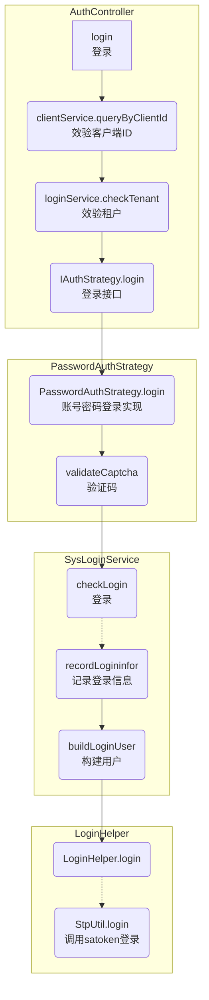
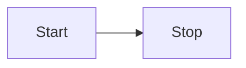

# ruoyi-vue-plus 源码分析之登录流程

## 流程图

```mermaid
flowchart TD
        subgraph AuthController
		A["login<br/>登录"]-->B("clientService.queryByClientId<br/>效验客户端ID")
		B-->C("loginService.checkTenant<br/>效验租户")
		C-->D("IAuthStrategy.login<br/>登录接口")
		end
		subgraph PasswordAuthStrategy
		D-->E("PasswordAuthStrategy.login<br/>账号密码登录实现")
		E-->F("validateCaptcha<br/>验证码")
		end
		subgraph SysLoginService
		F-->G("checkLogin<br/>登录")
		G-.->H("recordLogininfor<br/>记录登录信息")
		H-->I("buildLoginUser<br/>构建用户")
		end
		
		subgraph LoginHelper
		I-->M("LoginHelper.login")
		M-.->N("StpUtil.login<br/>调用satoken登录")
		end
```

##

<!---any-file.md-->

```mermaid
flowchart LR
  Start --> Stop
```
